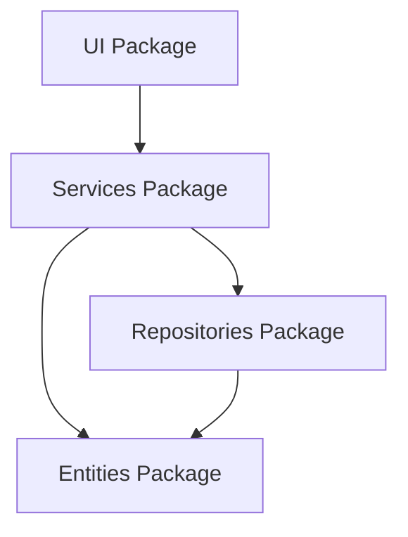
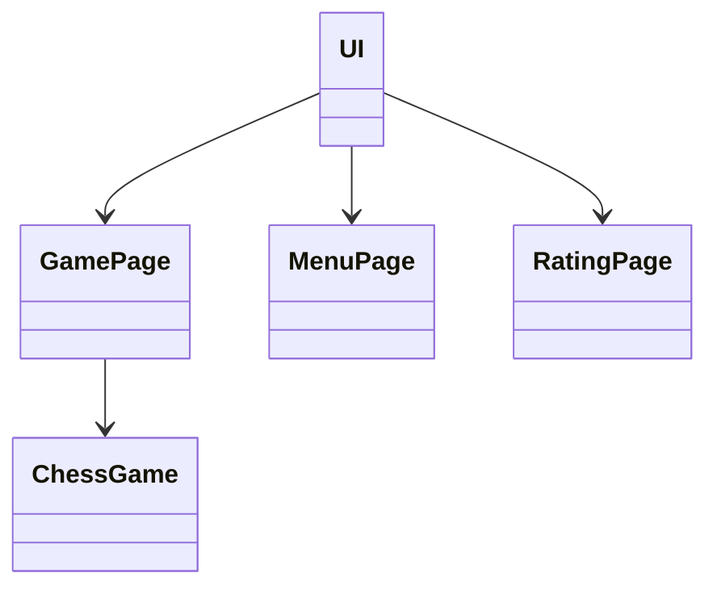

## Pakkauskaavio
Ohjelman yleinen rakenne.

```mermaid
flowchart TD
    %% UI Layer
    UI[UI Package]

    %% Service Layer
    Services[Services Package]

    %% Repository Layer
    Repositories[Repositories Package]

    %% Entities
    Entities[Entities Package]

    %% Connections
    UI --> Services
    Services --> Repositories
    Services --> Entities
    Repositories --> Entities
```

## Tämän hetken luokkakaavio
En ole vielä päättänyt miten toteutan käyttäjät, pelihistorian, ratingin tallennuksen.

```mermaid
classDiagram
    UI --> GamePage
    UI --> MenuPage
    UI --> RatingPage
    GamePage --> ChessGame
```

