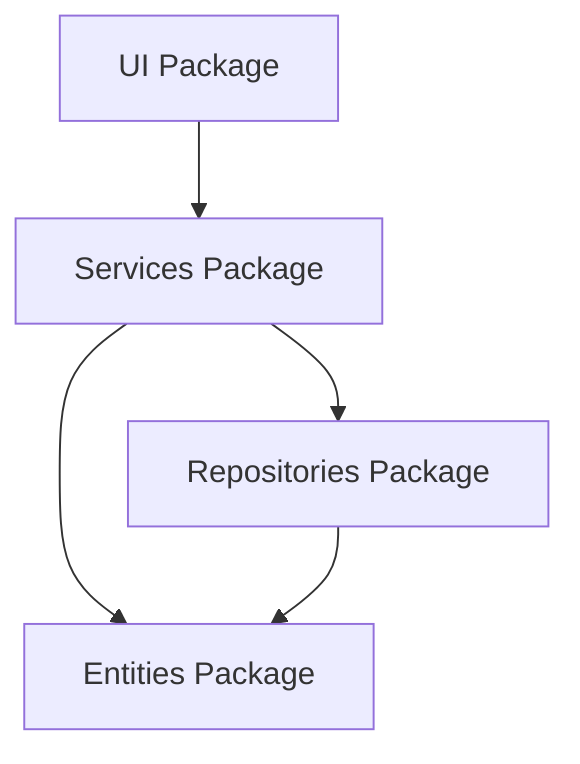
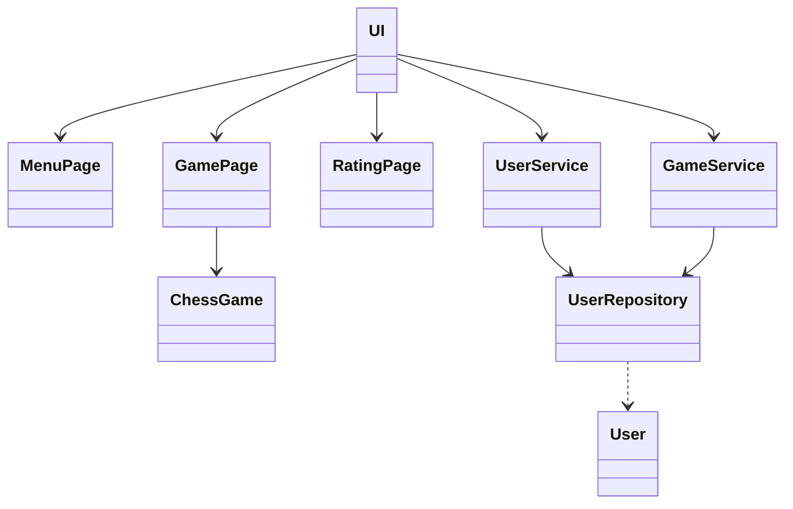
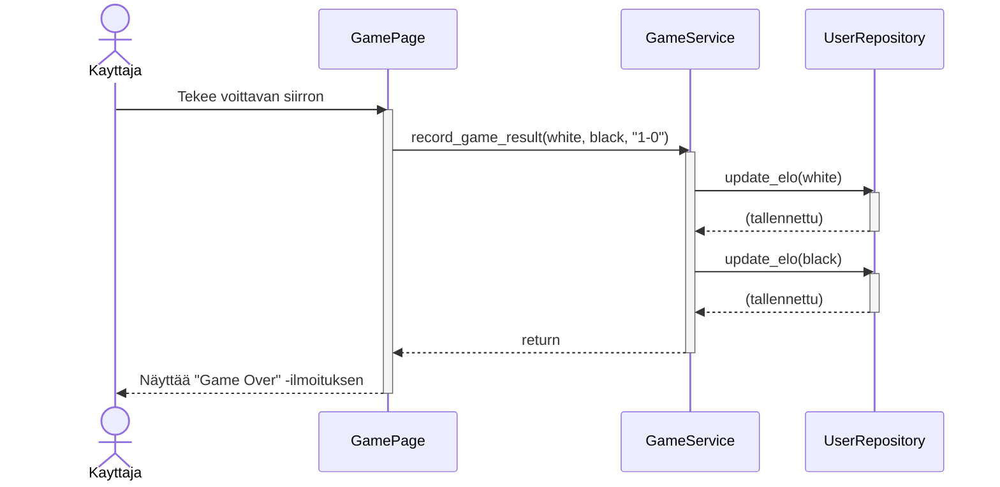

## Pakkauskaavio
Ohjelman yleinen rakenne.

## Tämän hetken luokkakaavio
En ole vielä päättänyt miten toteutan pelihistorian.

## Voittavan siirron sekvenssikaavio
Tämä kuvaa voittavaa siirtoa, jolloin peli päättyy ja pelaajien ELO-rating päivitetään.

