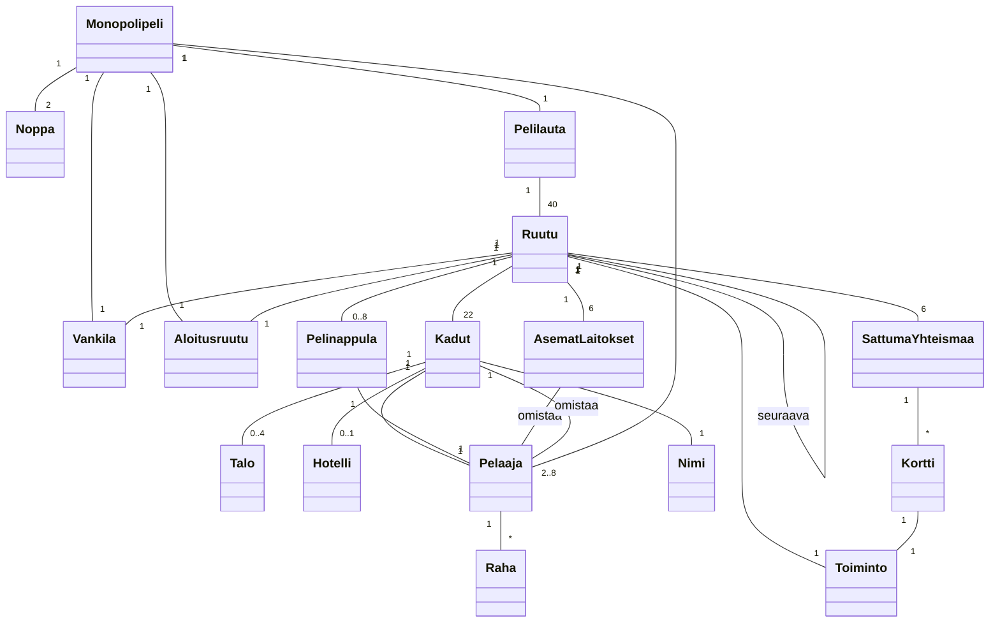

## Monopoli, alustava luokkakaavio

```mermaid
classDiagram
    Monopolipeli "1" -- "2" Noppa
    Monopolipeli "1" -- "1" Pelilauta
    Monopolipeli "1" -- "1" Vankila
    Monopolipeli "1" -- "1" Aloitusruutu
    Pelilauta "1" -- "40" Ruutu
    Ruutu "1" -- "1" Ruutu : seuraava
    Ruutu "1" -- "0..8" Pelinappula
    Ruutu "1" -- "22" Kadut
    Kadut "1" -- "0..4" Talo
    Kadut "1" -- "0..1" Hotelli
    Kadut "1" -- "1" Pelaaja
    Kadut "1" -- "1" Nimi
    Ruutu "1" -- "6" SattumaYhteismaa
    Ruutu "1" -- "1" Toiminto
    SattumaYhteismaa "1" -- "*" Kortti
    Kortti "1" -- "1" Toiminto
    Ruutu "1" -- "6" AsematLaitokset
    Ruutu "1" -- "1" Vankila
    Ruutu "1" -- "1" Aloitusruutu
    Pelinappula "1" -- "1" Pelaaja
    Pelaaja "2..8" -- "1" Monopolipeli
    Pelaaja "1" -- "*" Raha
    AsematLaitokset -- Pelaaja : omistaa
    Kadut -- Pelaaja : omistaa
```
